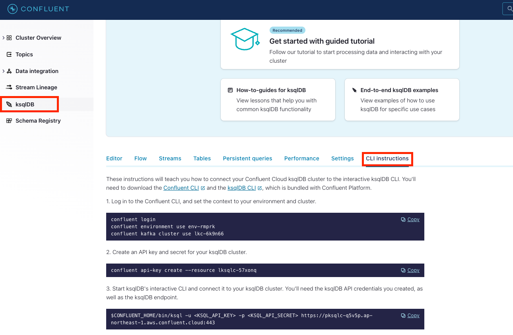
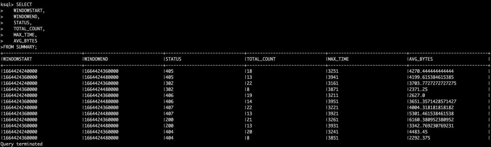
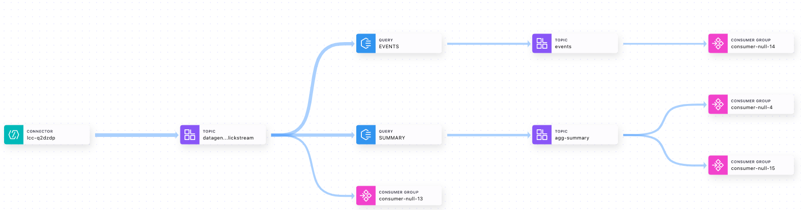

# ksqlDB Clickstream Workshop (日本語)
Confluent Cloudを利用してクリックストリームのデータを加工/分析するワークショップです。クリックストリーム用のテストデータの作成とksqlDBによるStream/Tableの利用方法、Pull Queryの基本的な使用方法等を体験いただけます。

## Confluent CLI
https://github.com/shinichi-hashitani/confluent-cloud-workshop-jp#confluent-cli
```confluent login --save ``` でConfluent Cloudにログインしたのち作業を開始します。

### Connect共通API Keyの作成
```bash
confluent api-key create --description "Common Key for Connectors" --resource lkc-0x21o5 -o json
```

### DataGen用Topicの作成
```bash
confluent kafka topic create datagen-clickstream
```
### DataGen Connectorの作成
```bash
confluent connect create --config connect/datagen-config.json
```

## ksqlDB 準備
### Confluent Platformのダウンロード
https://docs.confluent.io/platform/current/installation/installing_cp/zip-tar.html#get-the-software
** 利用するのはbinフォルダにあるcliツールのみ

ダウンロードしたバイナリを解凍後、フォルダへのパスをENV ```CONFLUENT_HOME```に設定。

Confluent Cloudに、環境に合わせたクライアントからの接続手順があります。手順に合わせてAPI Key/Secretを設定の上接続します。

```bash
$CONFLUENT_HOME/bin/ksql -u <KSQL_API_KEY> -p <KSQL_API_SECRET> https://pksqlc-xxxxx.ap-northeast-1.aws.confluent.cloud:443
```

## Transformation
クリックストリーム用のTopicデータをStreamとして定義。
```sql
CREATE STREAM Clickstream (
    IP VARCHAR,
    USERID INT,
    REMOTE_USER VARCHAR,
    TIME VARCHAR,
    _TIME INT,
    REQUEST VARCHAR,
    STATUS VARCHAR,
    BYTES VARCHAR,
    REFERRER VARCHAR,
    AGENT VARCHAR
) WITH (
KAFKA_TOPIC='datagen-clickstream', VALUE_FORMAT='JSON');
```
いくつかのフィールドに限定し、かつHTTP Statusが200のイベントのみを抽出して```Events```というStreamに変換。

```sql
CREATE STREAM Events
WITH (KAFKA_TOPIC='events', VALUE_FORMAT='JSON')
AS SELECT
    IP,
    USERID,
    _TIME TIME_IN_INT,
    STATUS,
    BYTES
FROM Clickstream
WHERE STATUS = '200'
EMIT CHANGES;
```

## Aggregation
クリックストリームのデータをStatus毎に集計し、マテリアライズドビュー（Table) として定義。今回は2分毎に集計。
```sql
CREATE TABLE Summary
WITH (KAFKA_TOPIC='agg-summary', VALUE_FORMAT='JSON')
AS SELECT
    STATUS,
    COUNT(*) TOTAL_COUNT,
    MAX(_TIME) AS MAX_TIME,
    AVG(CAST(BYTES AS INT)) AS AVG_BYTES
FROM Clickstream
WINDOW TUMBLING (SIZE 2 MINUTES)
GROUP BY STATUS;
```
マテリアライズドビューをPull Queryで参照。
```sql
SELECT
    WINDOWSTART,
    WINDOWEND,
    STATUS,
    TOTAL_COUNT,
    MAX_TIME,
    AVG_BYTES
FROM SUMMARY;
```
結果：

Stream Lineageでフローを確認：
